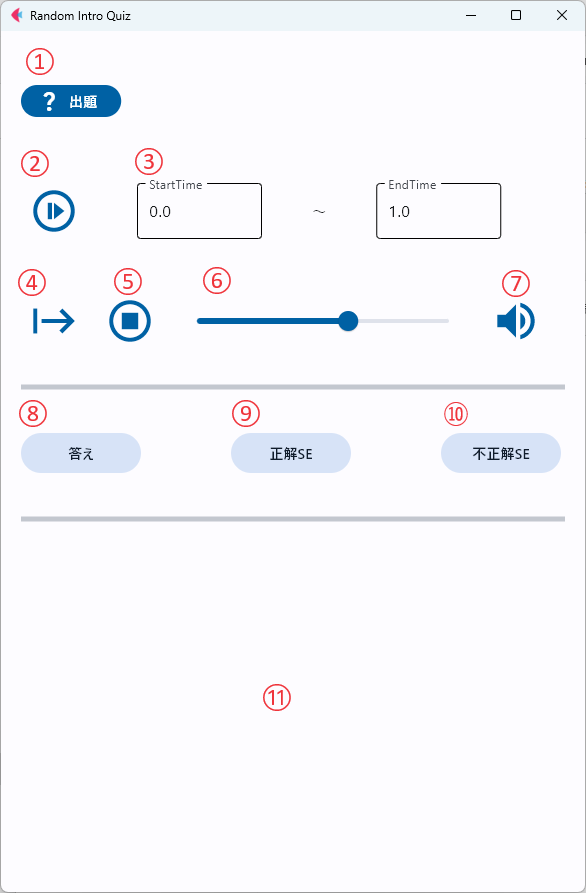

# RandomIntroアプリ　使い方

## フォルダ構成

<pre>
・
├─IntroMusic/
    ├─Before_Quiz.png
    ├─(イントロ音楽ファイル名)(.mp3 or wav)
    └─(イントロ音楽ファイル名と同名の画像)(.png or jpg or jpeg)  
├─Soundeffects/
    ├─correct_answer.mp3
    └─incorrect_answer.wav
└─bin/
    └─RandomIntro.exe
</pre>

## 使い方

### 注意点
[Soundeffects]内に保存する正解、不正解BGMは自分で選び、保存して活用してください。  
自分は以下URLからDLしました。  
* 正解BGM(correct_answer.mp3)：
* 不正解BGM(incorrect_answer.wav)
### GUI説明

* ①　?出題  
  [IntroMusic]フォルダに入っている音楽ファイル（mp3 ore wav）をランダムで選択、GUI上部に音楽ファイル名を表示する。
  
* ②　イントロ再生ボタン  
  ③で選択した区間の音楽を再生する
  
* ③　イントロ区間  
  StartTime: 開始時間  
  EndTime: 終了時間
  
* ④　フル音楽再生 / 停止ボタン  
　音楽を最初～最後まで再生するボタン。  
　一度押すと一時停止ボタンとなる。  
　一時停止ボタンを押すと停止位置から再生される。

* ⑤　音楽停止ボタン  
　再生している音楽を停止する  

* ⑥　音量コントロールバー  
　MAX 100として音量を調整する

* ⑦　音量無効ボタン  
  押すと音量を0にする。再度押すと音量無効ボタンを押す前の音量に戻す。

* ⑧　答えボタン
  選択中の音楽ファイル名を⑪に表示する。  
  また選択中の音楽ファイルと同名の画像ファイルを[IntroMusic]内から探し、存在する場合は⑪に表示する。

* ⑨　正解BGM再生ボタン
  [Soundeffects]フォルダ内の”OK”が付く効果音を再生する

* ➉　不正解BGM再生ボタン
  [Soundeffects]フォルダ内の”NG”が付く効果音を再生する

* ⑪　正解情報表示領域
  ⑧を押すと、ここに正解名と正解画像を表示する

