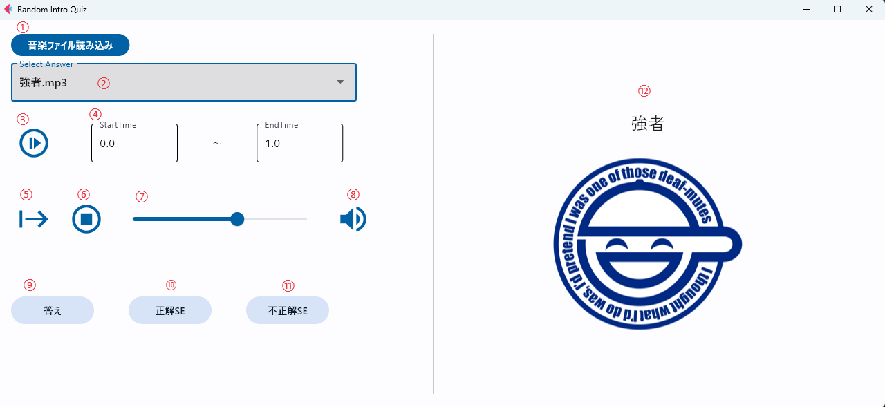

# RandomIntroアプリ　使い方

## フォルダ構成

<pre>
・
├─InitData/
    ├─Before_Quiz.png
├─IntroMusic/
    ├─(イントロ音楽ファイル名)(.mp3 or wav)
    └─(イントロ音楽ファイル名と同名の画像)(.png or jpg or jpeg)  
├─Soundeffects/
    ├─OK.(mp3 or wav)
    └─NG.(mp3 or wav)
└─bin/
    └─（exe化するなら、ここに置いて）
└─src
    ├─main.py   (メイン)
    └─state.py  (状態監視)

</pre>

## 使い方
イントロクイズ用アプリです。  
[IntroMusic]に音楽ファイル（mp3 or wav形式）を置いていただければ、イントロクイズができます。  
[IntroMusic]音楽ファイルと同名の画像ファイル（png or jpeg形式）を置くと、答えボタンを押した時にその画像が表示されます。 

### 注意点
[InitData]内の"Before_Quiz"は削除しないでください。アプリが起動しなくなります。  
  
[Soundeffects]内に保存する正解、不正解BGMは自分で選び、保存して活用してください。  
自分は以下URLからDLしたものを使っています。  
* 正解BGM(OK.(mp3 or wav))：https://commons.nicovideo.jp/works/nc69990
* 不正解BGM(NG.(mp3 or wav))：https://commons.nicovideo.jp/works/nc43688
### GUI説明

* ①　音楽ファイル読み込みボタン  
  [IntroMusic]フォルダに入っている音楽ファイル（mp3 ore wav）を参照し、②のDropDownボタンに反映する。

* ②　DropDownボタン
  出題する音楽ファイルを選択する

* ③　イントロ再生ボタン  
  ④で選択した区間の音楽を再生する
  
* ④　イントロ区間  
  StartTime: 開始時間  
  EndTime: 終了時間
  
* ⑤　フル音楽再生 / 停止ボタン  
　音楽を最初～最後まで再生するボタン。  
　一度押すと一時停止ボタンとなる。  
　一時停止ボタンを押すと停止位置から再生される。

* ⑥　音楽停止ボタン  
　再生している音楽を停止する  

* ⑦　音量コントロールバー  
　MAX 100として音量を調整する

* ⑧　音量無効ボタン  
  押すと音量を0にする。再度押すと音量無効ボタンを押す前の音量に戻す。

* ⑨　答えボタン
  選択中の音楽ファイル名を⑪に表示する。  
  また選択中の音楽ファイルと同名の画像ファイルを[IntroMusic]内から探し、存在する場合は⑪に表示する。

* ➉　正解BGM再生ボタン
  [Soundeffects]フォルダ内の ”OK” が付く効果音を再生する

* ⑪　不正解BGM再生ボタン
  [Soundeffects]フォルダ内の ”NG” が付く効果音を再生する

* ⑫　正解情報表示領域
  ⑨を押すと、ここに正解名と正解画像を表示する

